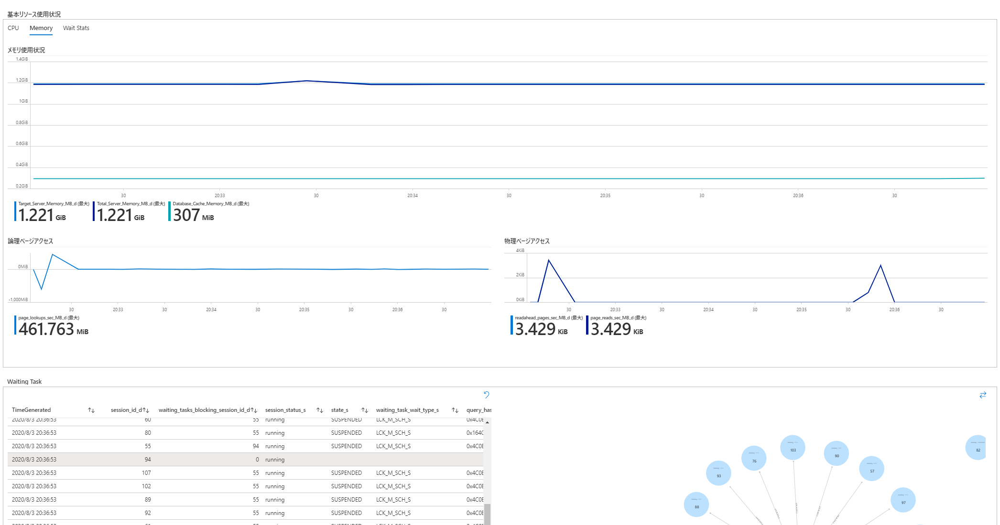
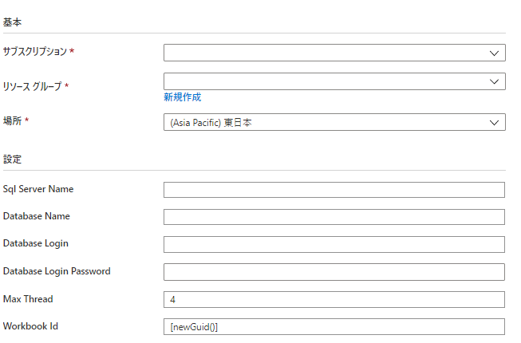

# Easy Monitor
<a href="https://portal.azure.com/#create/Microsoft.Template/uri/https%3A%2F%2Fraw.githubusercontent.com%2FMasayukiOzawa%2FEzMonitor%2Fmaster%2FDeployments%2Fazuredeploy.json" target="_blank">
  
</a>

Easy Monitor is a SQL Database metrics collection function that uses Azure Functions and Log Analytics.  
Deploying from Deploy to Azure using the ARM Template will also include the Workbook, which makes metrics visible.

 

## How to deploy
1. Deploy the ARM template from deploy to Azure.  
<a href="https://portal.azure.com/#create/Microsoft.Template/uri/https%3A%2F%2Fraw.githubusercontent.com%2FMasayukiOzawa%2FEzMonitor%2Fmaster%2FDeployments%2Fazuredeploy.json" target="_blank">
  
</a>  

2. Enter the required information and proceed with the deploy.    
  - Sql Server Name :  Name of the SQL Database from which to obtain information (ex : contoso.database.windows.net)  
  - Database Name : Target DB
  - Database Login : SQL Database Login Name
    If you are using Premium / Business Critical, you can create a login to the target DB by executing the following query.  
    For other service levels, you cannot grant the required privileges, so you will need to connect as an administrator of the SQL Database.
    ```
    CREATE USER <Login Name> WITH PASSWORD='<Password>'
    GRANT VIEW DATABASE STATE TO <Login Name>
    ```
    - Max Thread : Specifies how many parallels to obtain information when the function is executed



After deployment, the Workbook for Log Analytics is deployed in the Resource group.  
  
The information captured in Log Analytics by Azure Functions can be viewed in this workbook.


## Reference information
- Deploy to Azure
  - [Use a deployment button to deploy templates from GitHub repository](https://docs.microsoft.com/en-us/azure/azure-resource-manager/templates/deploy-to-azure-button)
- Azure Functions
  - [https://docs.microsoft.com/en-us/azure/azure-functions/functions-reference-powershell](https://docs.microsoft.com/en-us/azure/azure-functions/functions-reference-powershell)
  - [Run your Azure Functions from a package file](https://docs.microsoft.com/en-us/azure/azure-functions/run-functions-from-deployment-package)
- Log Analytics
  - [Send log data to Azure Monitor with the HTTP Data Collector API (public preview)](https://docs.microsoft.com/en-us/azure/azure-monitor/platform/data-collector-api)
  - [Azure Monitor log queries](https://docs.microsoft.com/en-us/azure/azure-monitor/log-query/query-language)
  - [SQL to Azure Monitor log query cheat sheet](https://docs.microsoft.com/en-us/azure/azure-monitor/log-query/sql-cheatsheet)
  - [Kusto Query Language Overview](https://docs.microsoft.com/ja-jp/azure/data-explorer/kusto/query/)
  - [Azure Monitor Community Repository is now available](https://azure.microsoft.com/en-us/updates/azure-monitor-community-repository-is-now-available-2/)
- Log Analytics Workbook
  - [Azure Monitor Workbooks](https://docs.microsoft.com/en-us/azure/azure-monitor/platform/workbooks-overview)
  - [Create interactive reports Azure Monitor for VMs with workbooks](https://docs.microsoft.com/en-us/azure/azure-monitor/insights/vminsights-workbooks)
